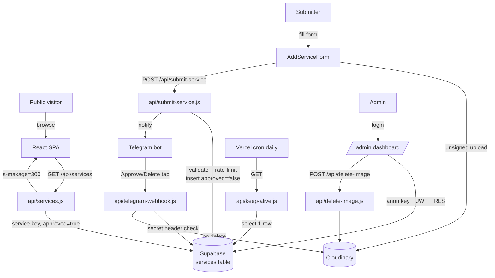
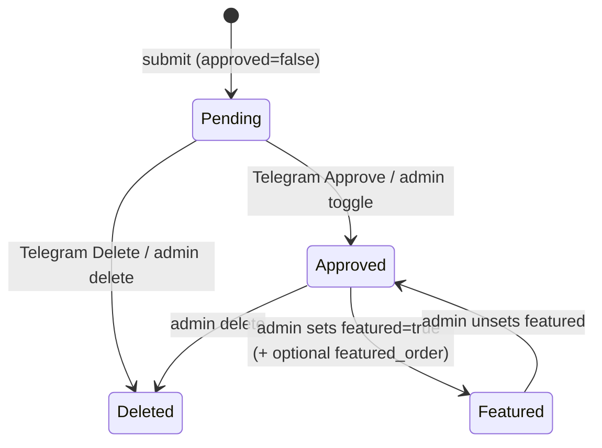

# Technical Guide

A deep, self-contained reference for **Spilno.us** — how the system fits together, where everything lives, how to run and deploy it, and the non-obvious decisions to respect.

> Scope note: This guide was generated by reading the repository at branch `feature/mvp-implementation`. Items that the code could not confirm are marked **[Assumption]** or collected in [§17 Open Questions](#17-open-questions--future-work). Do not treat assumptions as fact.

---

## 1. What This Is

**Mission:** A bilingual (English/Ukrainian) directory of trusted Ukrainian professional service providers for the Texas community.

**State:** Production — live at **[spilno.us](https://www.spilno.us/)**.

**Roles:**

| Role | Account? | What they do | How |
| --- | --- | --- | --- |
| Public visitor | No | Browse, search, filter approved listings | React SPA |
| Submitter | No | Submit a new listing (pending review) | Public form + honeypot + rate limit |
| Admin (single) | Yes (Supabase auth) | Approve / edit / delete / feature listings | Two redundant flows — see below |

**Major moving parts:**

- **React SPA** (public site + admin dashboard) — single bundle, client-side routed.
- **Vercel serverless functions** (`/api/*`) — read proxy, submission handler, image delete, Telegram webhook, keep-alive cron.
- **Supabase Postgres** — single `services` table, RLS-protected.
- **Cloudinary** — image hosting (unsigned client upload, signed server delete).
- **Telegram bot** — submission notifications with inline Approve/Delete buttons.

**Two redundant admin flows — intentional:**

1. **Telegram** — admin taps Approve/Delete inline button on the notification message (approve from phone, no login).
2. **Web admin** — `/admin` dashboard (Supabase auth) with a review queue, full-text search, and an edit panel.

---

## 2. Architecture



### Representative end-to-end flow — a new submission

1. Submitter fills `AddServiceForm`. Selected images upload directly to Cloudinary via **unsigned** preset; the form holds the returned `secure_url`s.
2. On submit, the browser `POST`s JSON to `/api/submit-service`.
3. Handler ([api/submit-service.js](../api/submit-service.js)) silently 200s if the honeypot is filled, then validates required fields, the category allowlist, formats, and length limits.
4. Rate limit: counts this email's rows in the last 24h; `>= 3` → `429`.
5. Inserts a row with `approved=false` using the **service key** (bypasses RLS).
6. Fires a Telegram notification ([api/_lib/telegram.js](../api/_lib/telegram.js)) with inline **Approve** / **Delete** buttons carrying `approve_<uuid>` / `delete_<uuid>` callback data. Telegram failure is logged, not fatal.
7. Admin taps a button → Telegram calls `/api/telegram-webhook` → secret-token header verified → row flipped to `approved=true` (approve) or deleted along with its Cloudinary images (delete). The message is edited in place to show the result.

---

## 3. Repository Structure

```text
spilno-us/
├── api/                       # Vercel serverless functions (Node)
│   ├── _lib/
│   │   ├── supabase.js        # getSupabaseAdmin() + fetchApprovedServices()
│   │   ├── telegram.js        # buildMessageText() + sendTelegramNotification()
│   │   └── cloudinary.js      # delete by public_id / delete CSV of image URLs
│   ├── services.js            # GET  — public read of approved services (cached)
│   ├── submit-service.js      # POST — validate + rate-limit + insert + notify
│   ├── delete-image.js        # POST — delete one Cloudinary image by publicId
│   ├── telegram-webhook.js    # POST — handle Approve/Delete button callbacks
│   ├── keep-alive.js          # GET  — daily cron, pings DB to keep project warm
│   └── *.test.js              # Vitest unit tests (mocks for Supabase/Telegram/Cloudinary)
├── src/
│   ├── App.jsx                # Router + providers; admin routes lazy-loaded
│   ├── main.jsx               # React root + Vercel SpeedInsights
│   ├── index.css              # Tailwind v4 @theme tokens (colors, fonts, shadow)
│   ├── components/
│   │   ├── UI/                # Button, Icon, Tag, BackToTop
│   │   ├── Header/            # Header, Logo, CategoryMenu, LanguageSelector, ThemeToggle, MobileMenu
│   │   ├── Hero/              # Hero, SearchBar
│   │   ├── ServiceCard/       # ServiceCard, ImageGallery (lightbox), SocialLinks
│   │   ├── ServiceList/       # ServiceList (grid + loading skeleton + error)
│   │   ├── Footer/            # Footer
│   │   └── AddServiceForm/    # Public submission form (Cloudinary upload inline)
│   ├── pages/
│   │   ├── HomePage.jsx       # Filtering + highlighted/rest service sections
│   │   ├── AddServicePage.jsx, PrivacyPage.jsx, TermsPage.jsx, NotFoundPage.jsx
│   │   └── admin/
│   │       ├── AdminLoginPage.jsx    # Supabase email/password sign-in
│   │       ├── AdminLayout.jsx       # Auth guard + nav + pending badge
│   │       ├── AdminQueuePage.jsx    # Pending review queue (approve/delete)
│   │       └── AdminServicesPage.jsx # All services table + slide-over EditPanel
│   ├── context/              # LanguageContext, ThemeContext
│   ├── hooks/                # useLanguage, useTheme, useServices
│   ├── lib/supabaseClient.js # Browser Supabase client (anon key) — admin only
│   ├── services/api.js       # fetchServices() — calls /api/services
│   ├── utils/                # validation.js, imageUrl.js (+ tests)
│   ├── data/categories.js    # 21 categories, 105 subcategories, helpers
│   └── i18n/                 # en.json, ua.json
├── supabase/
│   ├── schema.sql            # services table + public read RLS policy
│   └── admin-rls.sql         # Admin full-access RLS policy (run once)
├── vite.config.js            # Vite + local /api/* dev middleware
├── vercel.json               # Security headers (CSP) + SPA rewrite
├── .env.example              # All env var names
├── CLAUDE.md                 # AI/contributor project instructions (current)
└── README.md                 # Project overview + setup (current)
```

---

## 4. Tech Stack

| Layer | Technology | Why (for this project) |
| --- | --- | --- |
| UI framework | React 19 | Component model; lazy-loaded admin split |
| Build / dev | Vite 7 | Fast HMR; doubles as local `/api/*` server via middleware plugin |
| Styling | Tailwind CSS v4 (`@tailwindcss/vite`) | Utility-only; design tokens via `@theme` in `index.css` |
| Routing | React Router 7 | Client-side SPA routes incl. nested admin routes |
| Combobox | `@headlessui/react` | Accessible category autocomplete in the submit form |
| DB | Supabase (Postgres) | Managed Postgres + RLS + email/password auth for admin |
| Image hosting | Cloudinary | Unsigned client upload + `f_auto,q_auto,w_1200` transforms |
| Notifications | Telegram Bot API | Zero-infra approve/delete-from-phone flow |
| Hosting / functions | Vercel | SPA host + serverless `/api` + cron |
| Perf telemetry | `@vercel/speed-insights` | Mounted in `main.jsx` |
| Tests | Vitest | Native to Vite, no extra config |
| Lint | ESLint 9 (flat config) + react-hooks/react-refresh | `npm run lint` |

---

## 5. Data Architecture

Single table: **`services`** ([supabase/schema.sql](../supabase/schema.sql)). No separate users or categories tables — categories are hardcoded in [src/data/categories.js](../src/data/categories.js). **[Assumption]** the categories-in-code choice keeps bilingual labels and ordering in one place and avoids DB churn.

| Column | Type | Purpose |
| --- | --- | --- |
| `id` | uuid (PK, `gen_random_uuid()`) | Primary key |
| `title` | text (not null) | Business / provider name |
| `description_en` | text | English description |
| `description_ua` | text | Ukrainian description |
| `category` | text | A single subcategory string (see note) |
| `address` | text | Optional address |
| `phone` | text | Contact phone |
| `email` | text | Contact email (also rate-limit key) |
| `website` | text | URL |
| `instagram` / `facebook` / `linkedin` / `messenger` | text | Social links |
| `images` | text | **Comma-separated** Cloudinary URLs |
| `approved` | boolean (default false) | Visibility gate |
| `featured` | boolean (default false) | Homepage highlight |
| `featured_order` | integer (nullable) | Sort order within featured |
| `notes` | text | Internal admin notes (never shown publicly) |
| `submitted_at` | timestamptz (default now()) | Submission time; rate-limit + sort key |
| `created_at` | timestamptz (default now()) | Row creation |

**Notes on shape:**

- `category` is stored as a single text value, but the public homepage filter splits it on commas (`s.category?.split(',')`) — so the schema tolerates multi-category strings even though the submit form writes one.
- `images` is a comma-separated string, not an array. Parsed everywhere via `.split(',')` and filtered to `https://res.cloudinary.com/` prefixes.
- `messenger` exists in the schema and the admin edit panel but is **not** written by the public submit path. See [§17](#17-open-questions--future-work).

### Status lifecycle



Only `approved` gates public visibility. `featured` + `featured_order` only affect homepage ordering.

---

## 6. Core Subsystems

### 6.1 Public read path

- Browser never touches Supabase directly for public data. `useServices` ([src/hooks/useServices.js](../src/hooks/useServices.js)) → `fetchServices` ([src/services/api.js](../src/services/api.js)) → `GET /api/services`.
- [api/services.js](../api/services.js) calls `fetchApprovedServices` ([api/_lib/supabase.js](../api/_lib/supabase.js)) with the **service key**, filtering `approved=true`, newest first, optional `category`/`limit`/`lang`. Response cached `s-maxage=300, stale-while-revalidate=600`.
- The mapper adds a `submittedAt` alias and a language-resolved `description` (falls back to the other language if one is empty).

### 6.2 Submission

[api/submit-service.js](../api/submit-service.js): honeypot → required fields (`category, businessName, descriptionEn, descriptionUa, email`; **phone not required**) → category allowlist (`getAllSubcategories()`) → format regexes (email/phone/website/instagram/facebook/linkedin) → length limits → image filter (must start `https://res.cloudinary.com/`, max 5) → rate limit (≥3 for that email in 24h → 429) → insert `approved=false` → Telegram notify.

### 6.3 Authentication & authorization

- Admin only. Email/password via `supabase.auth.signInWithPassword` ([src/pages/admin/AdminLoginPage.jsx](../src/pages/admin/AdminLoginPage.jsx)).
- `AdminLayout` ([src/pages/admin/AdminLayout.jsx](../src/pages/admin/AdminLayout.jsx)) guards routes: on mount checks `getSession()`, redirects to `/admin/login` if absent, and subscribes to `onAuthStateChange` to redirect on sign-out.
- Authorization is enforced in Postgres by RLS: the admin policy ([supabase/admin-rls.sql](../supabase/admin-rls.sql)) grants full access only when `auth.jwt() -> 'app_metadata' ->> 'role' = 'admin'`. The browser uses the **anon key**; the JWT's role claim is what unlocks writes.
- **[Assumption]** the single admin user and its `app_metadata.role='admin'` claim are provisioned manually in the Supabase dashboard (no signup UI exists).

### 6.4 Telegram approve/delete bot

- Notify: [api/_lib/telegram.js](../api/_lib/telegram.js) `sendTelegramNotification` builds an HTML message and inline keyboard `[Approve][Delete]` with `approve_<id>` / `delete_<id>` callback data. No-ops if `TELEGRAM_BOT_TOKEN`/`TELEGRAM_CHAT_ID` are unset.
- Webhook: [api/telegram-webhook.js](../api/telegram-webhook.js) verifies `x-telegram-bot-api-secret-token` against `TELEGRAM_WEBHOOK_SECRET` (401 otherwise), immediately `answerCallbackQuery` (must be <10s), validates the UUID and action, then approves (idempotent — guards already-approved) or deletes (also purges Cloudinary images). Result is written back by editing the original message and clearing the buttons.
- **[Assumption]** the webhook URL + secret token are registered once with Telegram via `setWebhook` out of band (no registration script in the repo).

### 6.5 Cloudinary images

- Upload: client-side unsigned preset, inside [AddServiceForm](../src/components/AddServiceForm/AddServiceForm.jsx) (`uploadToCloudinary`, `MAX_IMAGES=5`, `MAX_FILE_SIZE=5MB`). Returns `secure_url`.
- Delete: server-side signed Admin API, [api/_lib/cloudinary.js](../api/_lib/cloudinary.js) — `deleteCloudinaryImageById` (single) and `deleteCloudinaryImages` (CSV, `Promise.allSettled`). Public id is recovered from the URL by regex.
- Display: [src/utils/imageUrl.js](../src/utils/imageUrl.js) `parseImageUrls` injects `f_auto,q_auto,w_1200` transforms.

### 6.6 Frontend filtering & i18n

- HomePage holds search + category as **mutually exclusive** filters (activating one clears the other; full reset only via `clearFilters`). Default view shows up to 6 highlighted (featured-first) then the rest.
- i18n is a custom `LanguageContext` ([src/context/LanguageContext.jsx](../src/context/LanguageContext.jsx)) with dot-path lookup over `en.json`/`ua.json`, persisted in `localStorage['lang']`. Theme is analogous (`localStorage['theme']`, toggles `dark` class on `<html>`).

---

## 7. API Reference

Base path `/api` (override with `VITE_API_BASE_URL`). All handlers reject non-matching methods with `405`.

### Public

| Method | Path | Purpose |
| --- | --- | --- |
| GET | `/api/services` | List approved services; query: `category`, `limit`, `lang` (`en`/`ua`). Cached 5 min. |
| POST | `/api/submit-service` | Submit a new listing (validated, rate-limited, honeypot). |

### Authenticated (called from the admin SPA; gated by header/secret, not session)

| Method | Path | Purpose |
| --- | --- | --- |
| POST | `/api/delete-image` | Delete one Cloudinary image by `publicId`. |

> Note: `/api/delete-image` has **no auth check** itself — it deletes any valid `publicId`. It is called from the admin UI but is not access-controlled. See [§14 Security](#14-security-model) and [§17](#17-open-questions--future-work).

### Webhooks

| Method | Path | Purpose |
| --- | --- | --- |
| POST | `/api/telegram-webhook` | Telegram callback handler; requires `x-telegram-bot-api-secret-token`. |

### Cron

| Method | Path | Schedule | Purpose |
| --- | --- | --- | --- |
| GET | `/api/keep-alive` | `0 0 * * *` (daily 00:00 UTC) | Pings DB (`select id limit 1`) to keep the Supabase project from idling. |

> Admin reads/writes to the `services` table go **directly** to Supabase from the browser (anon key + JWT + RLS), not through `/api`.

---

## 8. Frontend

| Route | Component | Notable behavior |
| --- | --- | --- |
| `/` | `HomePage` | Search/category filtering; highlighted (≤6, featured-first) + rest sections |
| `/add-service` | `AddServicePage` → `AddServiceForm` | Inline Cloudinary upload, honeypot, client validation |
| `/privacy` | `PrivacyPage` | Static |
| `/terms` | `TermsPage` | Static |
| `/admin/login` | `AdminLoginPage` (lazy) | Supabase email/password |
| `/admin` | `AdminLayout` (lazy) → index `AdminQueuePage` | Auth guard; pending-count badge |
| `/admin/services` | `AdminServicesPage` (lazy) | Table + search + status filter + slide-over `EditPanel` (drag-to-reorder images) |
| `*` | `NotFoundPage` | 404 |

**State management:** React Context only (no Redux/Zustand). `ThemeContext` + `LanguageContext` wrap the app in `App.jsx`. Server state is fetched ad hoc (`useServices` for public, direct Supabase calls in admin pages). Admin routes are code-split via `React.lazy`.

---

## 9. Testing

**82 tests across 6 files**, all Vitest. External services (Supabase, Telegram, Cloudinary) are mocked with `vi.mock()` — no real network/DB calls.

| File | Tests | Covers |
| --- | --- | --- |
| [api/submit-service.test.js](../api/submit-service.test.js) | 26 | All validation rules, honeypot, rate limiting, image filtering, success/error paths |
| [api/telegram-webhook.test.js](../api/telegram-webhook.test.js) | 15 | Secret check, UUID/action validation, approve/delete, idempotency, errors |
| [api/_lib/telegram.test.js](../api/_lib/telegram.test.js) | 11 | Message building, escaping, notification payload |
| [api/_lib/cloudinary.test.js](../api/_lib/cloudinary.test.js) | 8 | Public-id extraction, single/CSV delete |
| [src/utils/validation.test.js](../src/utils/validation.test.js) | 16 | `formatPhone`, `isValidURL`, `getSafeHref`, `getDomain` |
| [src/utils/imageUrl.test.js](../src/utils/imageUrl.test.js) | 6 | `getCloudinaryPublicId`, `parseImageUrls` |

**What is NOT tested:**

- No React component/UI tests (no Testing Library) — HomePage filtering, admin queue/edit, the form, contexts, hooks are untested.
- `api/services.js`, `api/delete-image.js`, `api/keep-alive.js` handlers — untested.
- `categories.js` helpers (`findParentCategory`, `getAllSubcategories`) — untested.
- The Vite local-dev `/api` middleware — untested (and diverges from prod, see §13).
- No integration/e2e tests.

---

## 10. Local Development

**Prerequisites:** Node.js 20+ (Vite 7 requires it), npm, and accounts for Supabase, Cloudinary, Telegram.

**Setup:**

```bash
git clone <repo>
cd spilno-us
npm install
cp .env.example .env     # fill in real values (see §11)
npm run dev              # Vite dev server with local /api middleware
```

**Commands:**

| Command | What it does |
| --- | --- |
| `npm run dev` | Vite dev server + local `/api/submit-service`, `/api/delete-image`, `/api/services` middleware |
| `npm run build` | Production build (`vite build`) |
| `npm run preview` | Serve the production build locally |
| `npm run lint` | ESLint (flat config) |
| `npm test` | Run all Vitest tests once |
| `npm run test:watch` | Vitest watch mode |

**Common first-run issues:**

- *`/api/services` returns non-JSON / HTML* — `services/api.js` throws a descriptive error telling you to set `VITE_API_BASE_URL` or run an API server. In `vite dev` the middleware handles it; in `vite preview` there is **no** API, so point `VITE_API_BASE_URL` at the deployed site.
- *Local submit requires a phone but prod does not* — the dev middleware ([vite.config.js](../vite.config.js)) requires `phone`; the deployed handler does not. Don't rely on local validation matching prod (see §13).
- *Local submit skips rate limiting and most format/length checks* — those exist only in the deployed `submit-service.js`.
- *Telegram/Cloudinary calls do nothing locally* — they no-op unless the server-side env vars are present (the Vite plugin copies them from `.env` into `process.env` during dev only).

---

## 11. Environment Variables

| Name | Scope | Required | Secret | Purpose |
| --- | --- | --- | --- | --- |
| `VITE_CONTACT_EMAIL` | client | Optional | No | Contact email shown in UI |
| `VITE_CLOUDINARY_CLOUD_NAME` | client | Yes (uploads) | No | Cloudinary cloud for unsigned upload |
| `VITE_CLOUDINARY_UPLOAD_PRESET` | client | Yes (uploads) | No | Unsigned upload preset |
| `VITE_SUPABASE_URL` | client | Yes (admin) | No | Supabase project URL (browser client) |
| `VITE_SUPABASE_ANON_KEY` | client | Yes (admin) | No | Supabase anon/publishable key (RLS-gated) |
| `VITE_API_BASE_URL` | client | Optional | No | Override `/api` base (e.g. for `vite preview`) |
| `SUPABASE_URL` | server | Yes | No | Supabase URL for serverless functions |
| `SUPABASE_SERVICE_KEY` | server | Yes | **Yes** | Service-role key — bypasses RLS in `/api` |
| `CLOUDINARY_CLOUD_NAME` | server | Yes | No | Cloudinary cloud for signed delete |
| `CLOUDINARY_API_KEY` | server | Yes | **Yes** | Cloudinary Admin API key |
| `CLOUDINARY_API_SECRET` | server | Yes | **Yes** | Cloudinary Admin API secret |
| `TELEGRAM_BOT_TOKEN` | server | Optional* | **Yes** | Bot token for notify + webhook calls |
| `TELEGRAM_CHAT_ID` | server | Optional* | No | Destination chat for notifications |
| `TELEGRAM_WEBHOOK_SECRET` | server | Optional* | **Yes** | Verifies incoming Telegram webhook calls |

\* Telegram vars are optional in the sense that the code no-ops without them, but they are required for the approval workflow to function in production.

---

## 12. Deployment

- **Platform:** Vercel. Frontend (Vite SPA) + serverless functions in `/api`.
- **Build command:** `vite build` (`npm run build`). SPA routing via [vercel.json](../vercel.json) rewrite `"/(.*)" → "/index.html"`.
- **Branch flow:** Per [CLAUDE.md](../CLAUDE.md), push to `main` auto-deploys. (Current working branch is `feature/mvp-implementation`; the repo's main branch for PRs is `development`.) **[Assumption]** production tracks `main`; confirm the Vercel project's production branch.
- **Cron:** `keep-alive` runs daily (`0 0 * * *`) via the `config.schedule` export in [api/keep-alive.js](../api/keep-alive.js).
- **Security headers / CSP:** set in `vercel.json` (see §14).
- **Env:** all server + client vars set in the Vercel dashboard.
- **Deploy-time gotcha:** `vite preview` and any non-Vercel host won't have the `/api` functions; the SPA then needs `VITE_API_BASE_URL` pointing at a host that does.

---

## 13. Local API vs. Production API — divergence (important)

The Vite dev middleware in [vite.config.js](../vite.config.js) reimplements three endpoints and **does not match** the deployed functions. Treat the deployed `api/*.js` as the source of truth.

| Aspect | Deployed `api/submit-service.js` | Local `vite.config.js` middleware |
| --- | --- | --- |
| Required fields | category, businessName, descEn, descUa, **email** | category, businessName, descEn, descUa, **phone**, email |
| Category allowlist | Enforced | Not enforced |
| Format regexes | Enforced | Not enforced |
| Length limits | Enforced | Not enforced |
| Rate limit (3/email/24h) | Enforced | Not enforced |
| Telegram notify | Yes | Yes |

Implication: a submission that passes locally may be rejected in production, and vice-versa. Validate against the deployed handler before trusting form behavior.

---

## 14. Security Model

- **RLS is the real boundary.** Public can only `select` rows where `approved=true`; all writes require the admin JWT role claim. The browser admin client uses the anon key — it cannot write without a valid admin session.
- **Service key isolation.** `SUPABASE_SERVICE_KEY` lives only in serverless functions; it bypasses RLS and must never reach the client. Public reads go through `/api/services`, which uses it server-side.
- **Submission hardening:** honeypot (silent 200), category allowlist, per-field format + length validation, image-URL allowlisting to Cloudinary, and a 3-per-email-per-24h rate limit.
- **Telegram webhook:** authenticated by a shared secret header (`x-telegram-bot-api-secret-token`), plus UUID and action validation.
- **HTML escaping:** Telegram messages escape `&<>"` ([api/_lib/telegram.js](../api/_lib/telegram.js)).
- **Browser headers** ([vercel.json](../vercel.json)): a strict CSP, `X-Content-Type-Options: nosniff`, `X-Frame-Options: DENY`, `Referrer-Policy: strict-origin-when-cross-origin`, `Permissions-Policy` disabling camera/mic/geo.
- **Known weak spot:** `/api/delete-image` has no authentication — anyone who knows a Cloudinary `publicId` can delete that image. It is only *called* from the admin UI but is not *protected*. See [§17](#17-open-questions--future-work).

### Rate limiting

The only rate limit is on submissions, in [api/submit-service.js](../api/submit-service.js):

- **Scope:** `POST /api/submit-service` only. No limit on `/api/services`, `/api/delete-image`, or `/api/telegram-webhook` (the webhook is gated by a secret instead).
- **Mechanism:** before insert, count `services` rows whose `email` (case-insensitive `ilike`) matches and whose `submitted_at` is within the last 24h. If the count is `>= 3`, return `429` and skip the insert.
- **Key:** the submitter's email — not IP. There is no Redis/KV store; the existing `services` table is the counter.
- **Limitations:** trivially bypassed by changing email; counts only *persisted* rows (honeypot-rejected and validation-failed requests don't count); enforced **only in production** — the local Vite middleware skips it (see §13).

For stronger or IP-based limiting (Cloudflare in front, or Upstash Redis + `@upstash/ratelimit` inside the function), see [docs/rate-limiting.md](rate-limiting.md). The current email limit is considered sufficient for form spam.

---

## 15. Key Patterns

- **Public never queries Supabase directly; admin always does.** Public traffic is proxied through `/api` (service key, cached); the admin SPA talks straight to Supabase (anon key + RLS). Respect this split.
- **Images are CSV strings, not arrays.** Always `.split(',')`, `.trim()`, and filter to the `https://res.cloudinary.com/` prefix before use. Reordering = rewriting the CSV (see `EditPanel` drag-and-drop).
- **Cloudinary public id is derived from the URL** via the regex `/\/upload\/(?:v\d+\/)?(.+)\.[^/.]+$/` — duplicated in `imageUrl.js`, `cloudinary.js`, and the form. Keep them in sync.
- **Telegram callback data is `action_uuid`** parsed at the first underscore; both sides must keep this format.
- **Filters are mutually exclusive** in HomePage — search and category clear each other; only `clearFilters()` resets both.
- **Design tokens live in `@theme`** ([src/index.css](../src/index.css)); use semantic Tailwind classes (`dark-blue`, `brand-red`, `brand-blue`, `text`, `stroke`, `shadow-card`) rather than raw hex. Dark mode swaps token values under `.dark`.
- **Validation is duplicated** intentionally: client (`AddServiceForm.validate`) for UX, server (`submit-service.js`) for trust. The server is authoritative.
- **Named exports** are the norm for components; mixed default/named usage exists (`App` is a default export).

---

## 16. Glossary

| Term | Meaning |
| --- | --- |
| **Service** | A directory listing (one row in `services`) — a provider/business, not a microservice. |
| **Approved** | `approved=true`; the only flag that makes a row publicly visible. |
| **Featured / featured_order** | Admin-curated homepage highlight and its sort position (lower first; null sorts last). |
| **Subcategory** | A leaf entry under a category (105 total); what `category` actually stores. |
| **Honeypot** | Hidden form field; if filled, the submit handler returns success but discards the row. |
| **Notes** | Internal admin-only text on a row; never rendered publicly. |
| **Service key** | `SUPABASE_SERVICE_KEY`, server-only, RLS-bypassing. Distinct from the browser anon key. |
| **Callback data** | Telegram inline-button payload, formatted `approve_<uuid>` / `delete_<uuid>`. |

---

## 17. Open Questions & Future Work

Items the code could not confirm, or known gaps worth flagging:

1. **Historical planning docs are stale.** README and CLAUDE.md are current, but several files under `docs/architecture/` and `docs/plans/` predate the current stack (they still describe the earlier Airtable / Google Forms / Google Drive design). They are kept as historical snapshots; this guide and [CLAUDE.md](../CLAUDE.md) are the accurate sources.
2. **`/api/delete-image` is unauthenticated.** Add an auth check (e.g. verify a Supabase admin JWT) or move deletion server-side behind the webhook/RLS, so it can't be called by anyone.
3. **`messenger` column is half-wired.** Present in schema + admin `EditPanel`, but not collected by the public form or written by `submit-service.js`. Decide: admin-only field, or wire it end-to-end, or drop it.
4. **Orphaned Cloudinary images.** Images upload to Cloudinary *before* the form is submitted; if the user abandons the form, the images are never referenced and are not cleaned up. **[Assumption]** this is accepted. Consider a cleanup strategy.
5. **Local dev API diverges from production** (see §13). Consider importing the real handlers into the Vite middleware so behavior matches.
6. **Google Analytics / GTM is allowed by CSP but not present in code.** `vercel.json` whitelists `googletagmanager.com` / `google-analytics.com`, yet there is no GA/GTM snippet in `index.html` or `src`. Either wire analytics or tighten the CSP.
7. **Admin provisioning + Telegram webhook registration are manual.** No scripts in-repo for creating the admin user / `app_metadata.role` claim or for `setWebhook`. Document the exact steps (or script them) so the setup is reproducible.
8. **Production branch unconfirmed.** CLAUDE.md says `main` auto-deploys; the repo's PR base is `development`. Confirm the Vercel project's production branch.
9. **No component/e2e tests.** Critical UI flows (submission, admin approve/edit/delete, filtering) are untested. Consider Testing Library + a Playwright smoke test.
